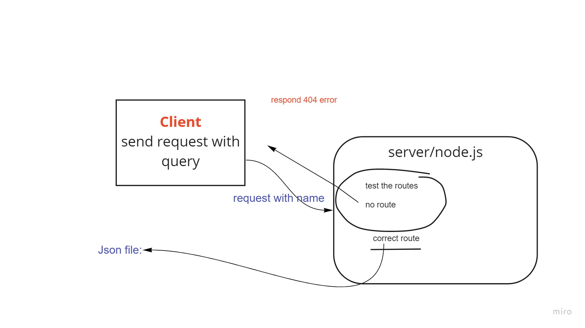

# basic-express-server - class02 /lab 2
its a backend server to practice using tests units and middlewares:

## Deployment Test
  * HEROKU URL: https://hanin-server-express.herokuapp.com/person?name=hanin 
  * BACKEND: https://github.com/HaninHaidrah/basic-express-server 
  * PULL request: https://github.com/HaninHaidrah/basic-express-server/pull/1
  *  https://github.com/HaninHaidrah/basic-express-server/pull/3

## SET UP:
> .env /PORT

## Running the app: 
> npm run dev // Endpoint: /pesron

## Tests:
> npm run test

## UML
*created by whiteboard online*

